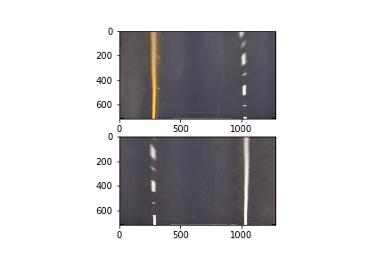
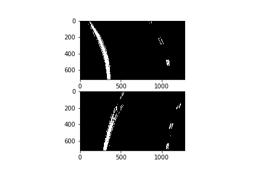

# Output images from various steps in the pipeline

01 "rawCamera...png":
---
 camera intrinsic calibration parameters are derived from a batch of chessboard images, applying to one chessboard as validation;

02 "mountedCamera...png":
---
 perspective transforms are derived from a distortion-corrected straightlane image, then applied back to two straight lane images as validation;

03 "warped activated lanepixels...png":
---
 a binary mask is generate based on element-wise OR of (a) s-channel intensity threshold, (b) l-channel gradient intensity and angle threshold; 

