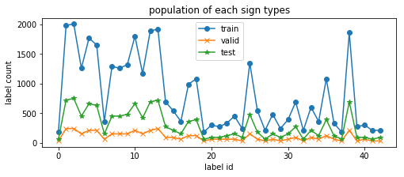
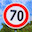
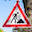

# **Traffic Sign Recognition** 

## Writeup

---

**Build a Traffic Sign Recognition Project**

The goals / steps of this project are the following:
* Load the data set
* Explore, summarize and visualize the data set
* Design, train and test a model architecture
* Use the model to make predictions on new images
* nalyze the softmax probabilities of the new images
* Summarize the results with a written report

### Data Set Summary & Exploration

#### 1. Provide a basic summary of the data set.

Once data are loaded, their dimensions are obtained via each variable's `.shape` attribute.  

For the "feature" data, with a 4-dimension shape of `(s0, s1, s2, s3)`, I know the size of the set is `s0`, and the images are of size `s1 x s2`, and color depth of `s3`.

For the "label" data, to find out unique labels, I simply created a `set()` per data set to ensure the unique-ness.  With 3 data sets (training, validation, testing), I added a `set(...) & set(...) & set(...)` step to get the super-set.

I also used a `assert min(y_labels) == 0 and max(y_labels) == 42` to make sure the unique labels are really 0 ... 42.

* The size of training set is 34799
* The size of the validation set is 4410
* The size of test set is 12630
* The shape of a traffic sign image is 32 x 32 (x 3 colors)
* The number of unique classes/labels in the data set is 43

#### 2. Include an exploratory visualization of the dataset.

Here is an exploratory visualization of the data set. It is a histogram showing how many of each label type we have in the data set.  It is worth noting that the distribution is not exactly uniform, with several label types much more frequently appearing that the rest (one example is the large delta between label id=0 and label id=1).

Apparently the train, valid, test sets all show the same trend, indicating the three data sets have been created with the above observation considered.

### Design and Test a Model Architecture

#### 1. Preprocesssing images

After viewing a few images in training set, it seems clear that the color information may be important, e.g. the going-straight arrow sign is white-on-blue, speed limit sign always has a red circle around it, etc.

I did normalize all image data to zero-centered and in range [-1.0, 1.0], as suggested in project descriptions.  An interesting find is that image is an array of type `uint`, so I did a `(image - 128.0) / 128` to typecast to float.

#### 2. My final model architecture is a slightly larger LeNet.

My final model consisted of the following layers:

| Layer         		|     Description	        					| 
|:---------------------:|:---------------------------------------------:| 
| Input         		| 32x32x3 RGB image   							| 
| Convolution 5x5     	| 1x1 stride, valid padding, outputs 28x28x16	|
| RELU					|												|
| Max pooling	      	| 2x2 stride,  outputs 14x14x16 				|
| Convolution 5x5	    | 1x1 stride, valid padding, outputs 10x10x32	|
| RELU			 		|												|
| Max pooling	      	| 2x2 stride,  outputs 5x5x32				|
| Fully connected		| 800 -> 240       									|
| Drop-out    |  keep_prob = 0.75  |
| Fully connected		| 240 -> 170       									|
| Drop-out   |  keep_prob = 0.75  |
| Fully connected		| 170 -> 43       					|
| Softmax				|         									|
 

#### 3. How I trained your model (type of optimizer, the batch size, number of epochs and any hyperparameters such as learning rate)

I used the same `Adam` optimizer as suggested in class.  The training is done with: `batch_size=128`, `epochs=20` (as a starting value).  

It is worth noting that I added the `shuffle` step for each loop of `epochs`, as suggested in class, and also the `evaluate` step using `X_valid` validation data set.

#### 4. Describe the approach taken for finding a solution and getting the validation set accuracy to be at least 0.93.

The solution finding, for me, is a trial-and-error process.  My main guidance is several indicators taught in class:
* how fast the accuracy improves from one epoch to the next? <--> `learn_rate`
* does accuracy keep increasing or does it fluctuates wildly? <--> `learn_rate`
* is accuracy still increasing towards the end? <--> `epochs`
* is there a large discrepancy between train and validation? <--> `drop out`
* is the NN just not able to reach higher accuracy? <--> expand the NN layer sizes

A laundry list of my incremental changes are:
1) remember to shuffle between epochs
2) test accuracy was already close to train accuracy: overfitting unlikely? a dropout=0.75 is added after the 1st fully-connected layer for good measure.
3) learn_rate=0.001, seems good as epoch-to-epoch accuracy is changing smoothly
4) epochs=30 gives accuracy of 0.94/0.92 (train/test), stabilizing after epochs=20
5) combining 3 & 4, it might be benefitial to try a lower learn_rate, with learn_rate=0.005, epochs=50, accuracy is 0.93/0.91(train/test), stabilized around epochs ~ 40.  ==> keep learn_rate=0.001, epochs=20
6) increased nn size, see comments, 2nd set of values, 0.95/0.935; reached 0.93 in 3 epochs, possibly indicating a smaller learn_rate??
7) with 6's setup, epochs=30, rate=0.0005, 0.95/0.93, reached in 25 epochs
8) reset to epochs=20, rate=0.001, with original nn size as 1st comment
9) changed the last 2 FC layers to 400-200-100-43, mu 0.1 to 0.2, with this setup: accuracy is 0.91/0.90, reached in 15 epochs ==> mu's impact??
10) repeat 9 but with mu=0.05, accuracy 0.92/0.915, reached in 18 epochs
11) reset back to setting in 4, attempts 5-10 showed little improvement. .93/.92
12) slightly tweaked 6, nn sizes as in 3rd comment, added another dropout after 2nd FC layer, 0.945/0.937, seemingly fluctuating a bit
13) same as 12, slower rate=0.0005, epochs=60, 0.96/0.94
14) final run with rate=0.0005, epochs=100, accuracy 0.96/0.945

My final model results were:
* training set accuracy of 1.00
* validation set accuracy of 0.96
* test set accuracy of 0.95

### Test a Model on New Images

#### 1. Choose five German traffic signs found on the web and provide them in the report.

Here are five German traffic signs that I found on the web.  My understanding is that the NN can only handle 32x32 images, so I simply google'd German traffic sign images and re-sized them to 32x32 before-hand.  Otherwise, I could simply use the Python Imaging Library `from PIL import Image` and `img.resize()`.

  
 

The first 3 images all have strong features in the background which might cause difficulty, the 4th has a large left-right contrast and the 5th has the sign somewhat blend into the background.

#### 2. Discuss the model's predictions on these new traffic signs and compare the results to predicting on the test set. At a minimum, discuss what the predictions were, the accuracy on these new predictions, and compare the accuracy to the accuracy on the test set (OPTIONAL: Discuss the results in more detail as described in the "Stand Out Suggestions" part of the rubric).

Here are the results of the prediction:

| Image			        |     Prediction	        					| 
|:---------------------:|:---------------------------------------------:| 
| 01_speed70.jpg      		| Speed limit (70km/h)  									| 
| 02_bumpy.jpg   			| Bumpy road										|
| 03_Children.jpg					| Children crossing											|
| 04_german-roadworks.jpg      		| Road work			 				|
| 05_german_rightofway.jpg			| Right-of-way at the next intersection     							|

The model was able to correctly guess 5 of the 5 traffic signs, which gives an accuracy of 100%. However, with a total of 5 images, this accuracy % value is statistically unreliable.

#### 3. Describe how certain the model is when predicting on each of the five new images by looking at the softmax probabilities for each prediction. Provide the top 3 softmax probabilities for each image along with the sign type of each probability.

For simplicity, I directly compThe code for making predictions on my final model is located in the 26th cell of the Ipython notebook.

For the first image, the model is very sure. The top five soft max probabilities were

| Probability         	|     Prediction	        					| 
|:---------------------:|:---------------------------------------------:| 
| 1.0         			| speed limit 70  									| 
| 6e-15     				| speed limit 30 										|
| 7e-26					| speed limit 80 										|

For the 2nd to 5th image, I see the same behavior, first prediction is extremely close to probablity of 1.0, with a second prediction far behind at probability of 1e-15 or lower.

Is this an indication that the images I picked are all too easy?  Or even worse, I could have google'd traffic sign images that happened to be part of the training data set???

